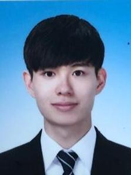

## About Me

Hi! I am a MS/Ph.D student in the Department of Artificial Intelligence at Korea University. My advisor is Prof. <a href="https://scholar.google.com/citations?hl=en&user=VJuuzLwAAAAJ">Christian Wallraven</a>, and I am part of the <a href="http://cogsys.korea.ac.kr/Cognitive_Systems.html">Cognitive Systems Lab</a>. 

- Phone : +82-10-5028-3288
- E-mail: hscho9384@korea.ac.kr

Please contact me if you want to know more about me!  See CV for more information.

 <!-- This is a jekyll based resume template. You can find the full source code on [GitHub] --> 
 <!-- (https://github.com/bk2dcradle/researcher) -->

---

## Education
### Sogang University School of Natural Science (2011/03/02 ~ 2018/02/20)
- Major: Math, Ecocomics

---

## Work Experience

### LG CNS / Data Scientist(DW/BI) (2018/01/01 ~ 2020/02/17)
- DW Management
- Analysis System for manufacturing data SI

### Teaching Assistant
- Advanced Econometrics / Sogang University (2016 Fall Semester)
- Data Science and AI / Korea University (2021 Spring Semester)
- AI/DT Course / SK FastCampus (2021/1/8 ~ 2021/1/11)

### Lecture
- Big Data Analysis with R / K-ICT (1st: 2021/4/7 ~ 2021/4/9, 2nd: 2021/7/12 ~ 2021/7/14) [GitHub](https://github.com/Heeseung-Cho/R_MiddleClass)

---

## Language Skill
- Java, .Net Framework, SQL/DBMS(Oracle,No)
- Python, R, SAS

---

## Research Interest
- Combine Reinforcement Learning & Game Theory to improve decision making
- Big Data Analysis
- Decision Making

---

## Current Research
### Balloon Analoug Risk Task(BART)
- Interpreting risk-takeness with personality scales

### Vision
- Model performance related with data complexity
- Uncertainty performance related with data complexity

### BCI 
- Behavior experiment

---

## Certification

### Advanced Data Analytics Semi-Professional 
- Certificated Date: 2016/06/28

### SAS Base Programming for SAS 9
- Certificated Date: 2016/08/22

---

## Honors & Awards

|Year|Award|Organization|Place|  
|:-----:|-------|----|----|
|2019| Kaggle | Santander Custoumer Transaction Prediction | Bronze Medal(760th) |
|2020| BigContest | Predicting future sales of NS home-shopping | Final |
|2021| MindCompany | Teeth detection | 3rd |

---

 <!-- This is a [link](http://google.com). Something *italics* and something **bold**.-->
 <!-- Here is a horizontal rule --- -->
 <!-- Here is a blockquote> To a great mind, nothing is little -->
